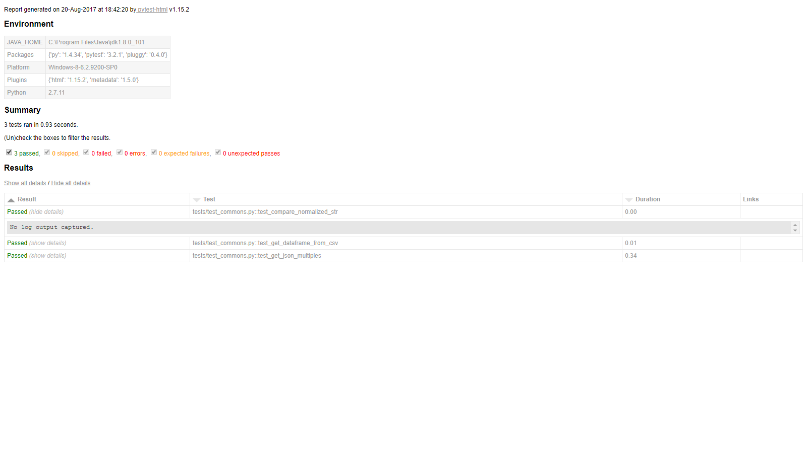

# BetterDoctor Data Platform Coding Challenge  

## Requirements:

* Process the data in match_file.csv against the data in source_data.json
* Try to match based on the following fields: NPI, Name (Use first and last), Address (using street, street_2, city, state and zip)

## Setting up your local environment:

  Install virtualenv and pip before you proceed with the following steps:

    mkvirtualenv <name> # Create virtual environment
    lsvirtualenv # List the virtual environment

  In the activated python environment:

    pip install -r requirements.txt

  Run the script

    python app/main.py

  Run the test

    pytest

  Generate html test report

    pytest --html=report.html

## Continuous Integration and Code Coverage

* Using [Travis CI](https://travis-ci.org/) for Continous integration
* Using [Codecov](https://codecov.io/) for Code Coverage

## Deployment using Docker

## Scaling using Docker Swarm
